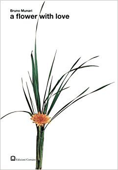
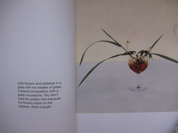
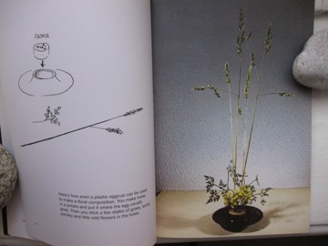
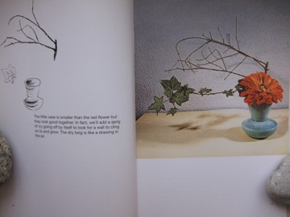

# PROJECT THREE README.md

## by Bridget Unterreiner

This project will span over the course of three weeks.

---
## "THE LITERATURE REVIEW"

### This assignment tasks us with creating a site that reviews a piece of literay work. I have chosen to review a book that I enjoy both reading and looking at titled *a flower with love* by Bruno Munari (pictured below). 

---

### A possible writing sample from the book's intro that captures a central theme in this piece of Munari's work...

> "It's mother's day, it's father's day, it's grandma's day, it's little brother's first birthday, mom's friend has had a new baby, its the carpenter's name-day, uncle George is here with aunt Ester, Ines is marrying Miro, Dnate has won a bicycle race, Emma has got better...How can we celebrate all these events, it would take bags of money to buy lots of flowers to put in vases of china, silver, pottery, cut glass, earthenware, pewter. But children don't have money, only a longing to have fun, so all we need is a stalk of grass and a daisy placed lovingly in a small receptacle foun in the toy drawer. What matters is the love with which the little flower and stalk of grass (that one there in particular and not that other one), are chosen, more than how much there is or how much it costs."

--- 
## AUTHOR BIO

### Here is a nice bio that I may reference by [FAMOUSGRAPHICDESIGNERS.COM](http://www.famousgraphicdesigners.org/bruno-munari)...

### And an artist's page from [MOMA](https://www.moma.org/artists/4163) which links to his Wikipedia bio while additionally providing examples of his design work 

---
## SITE COLOR PALLETTE

          
#FFAE42

        

          
#266A2E

        

          
#DF7D60

        

          
#FC4600

        

          
#9EAEB3

        

---
## FONT

### I think I will use ["ROBOTO"](https://fonts.google.com/specimen/Roboto) from Google Fonts for my site.

---
## AESTHETIC

My site will echo the clean, modern, minimalistic style of the book. It is clean, but detailed. Simple lines... plenty of white space... allows images to speak for themselves

---
## MY FINAL THOUGHTS ON PROJECT 3

### This project presented me with many challenges. However, the outcome was so much more rewarding than our previous projects. The introduction of CSS allowed much more room for creative freedom. This felt good! My sight looks a little basic, a little blocky, a little flat... but it took on this sort of retro aesthetic that I think echo's the look of my chosen book (published in 1973). I enjoyed being able to integrate original graphics through the creation of a simple logo. 