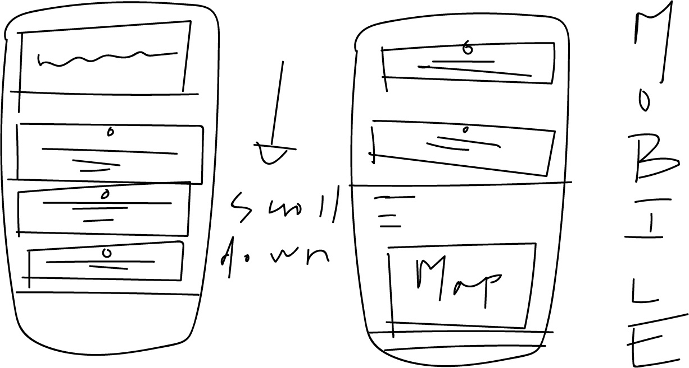
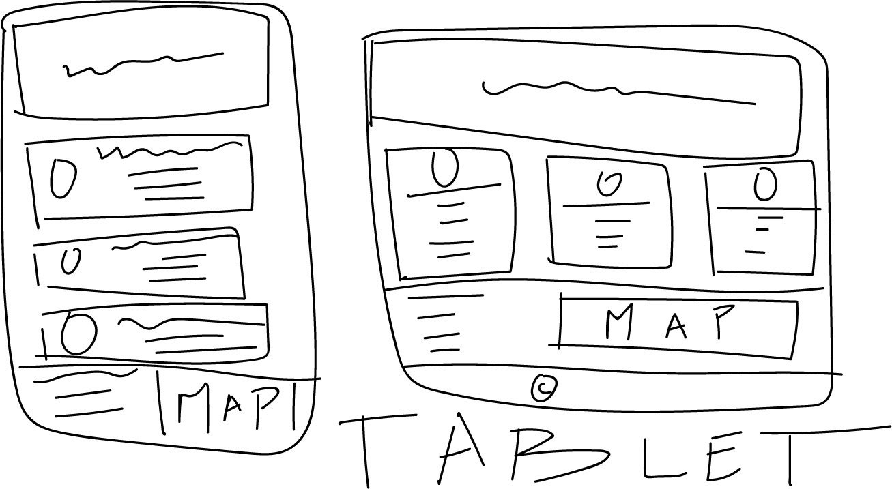
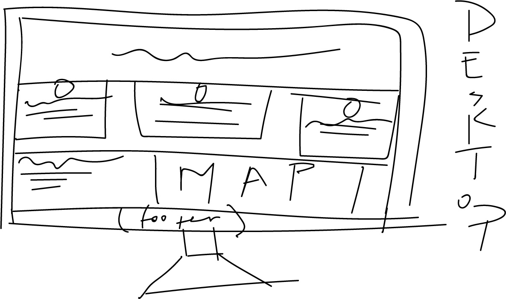

# PROJECT FOUR README.md

## by Bridget Unterreiner

---
## "Responsive Web Design"

### This assignment tasked us with creating a one-page 'site' that utilizes RESPONSIVE WEB DESIGN. 

---
## SITE CONTENT

### Topics of exploration...

- What (is it)
- Why (is it important)
- How (is it done)

---

## SITE DESIGN ELEMENTS

### WIREFRAMES
Included below are sketches outlining the basic layout of my site on various devices...

### DESIGN CONTENT

Hero Image (graphic image or pattern?)

Body Content 
- 3 sections (related to topics of exploration)
        - icons to create visual interest and differenitate each section

Contact
- 2 columns
    - Left column: phone, email, social media
    - Right: Google map

Footer 
- copyright 
- my name

### COLOR
- Background: #669999
- Footer: #0D4D4D
- Text color: white

### FONT
["LATO"](https://fonts.google.com/specimen/Lato) from Google Fonts 

---
## SPECIAL TOOLS

### Shoutout to [PALETTON.COM](http://paletton.com) for helping me create a cohesive color palette for my site!

### I also used [SVGENERATION.COM](http://www.svgeneration.com/recipes/Simple-Sun/) to create the cool sunbeam graphic for my hero image!
___
> "Design is not what it just looks like and feels like. Design is how it works." - STEVE JOBS
---
## MY FINAL THOUGHTS ON PROJECT 4

### This assigment felt both freeing and validating. It was the most open ended assignment we've had all semester. At first this was intimidating, but breaking down the project into parts helped this daunting task seem managable. I liked sitting down to sketch "wireframes" and actualize the ideas in my head before diving in to the code. 
